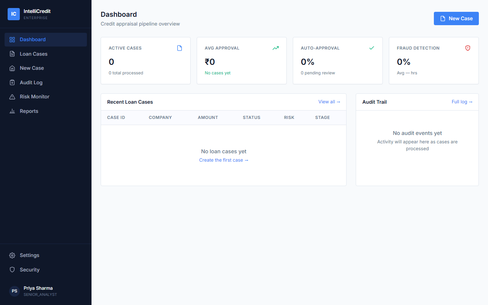
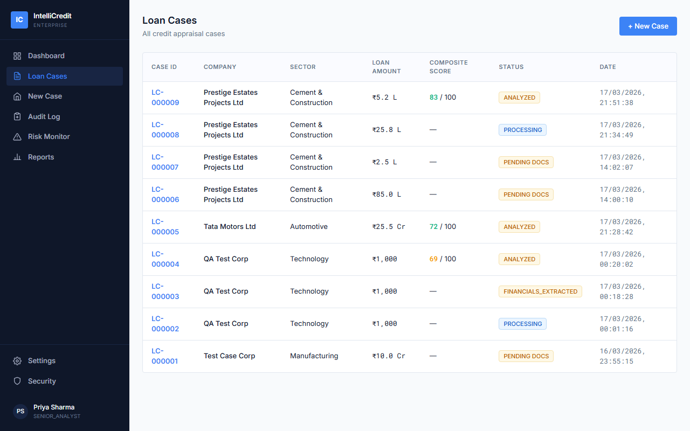

# IntelliCredit Hub

> **🏆 IIT Hyderabad Hackathon / Problem Statement Solution**  
> This project was developed as a comprehensive solution to a problem statement presented by IIT Hyderabad. It addresses the challenges of automating bank credit management and financial data extraction using AI/ML.

IntelliCredit Hub is an AI-powered bank credit management platform. It automates financial data extraction, runs machine learning verifications, and manages the entire credit evaluation process.

## Screenshots
| Dashboard | Cases List |
| :---: | :---: |
|  |  |


## Features
- **Credit Case Management**: Create and track credit evaluation cases.
- **Financial Data Extraction**: Extracts and parses financial metrics (Annual Turnover, Net Profit, Debt, etc.) from uploaded documents.
- **ML-Powered Verification**: Utilizes Machine Learning models (Random Forest, Isolation Forest, KMeans) trained on MCA datasets to verify corporate entities, flag anomalies, and assign risk scores.
- **Data Scraping & Analysis**: Integrates scrapers for news sentiment, corporate data, and litigation history to build a comprehensive risk profile.

## Tech Stack
- **Backend**: Python, Flask, SQLite
- **Frontend**: HTML5, CSS3, Vanilla JS
- **Machine Learning**: scikit-learn (Random Forest, Isolation Forest, KMeans)
- **Data Processing**: pandas, PyPDF2 / pdfplumber (for document extraction)

## Project Structure
- `app.py` / `api.py`: Main Flask application and API routes.
- `services/`: Core logic including the data agent, MCA verification, and scraping services.
- `ml_model/`: Contains scripts (`train_model.py`, `train_40_runs.py`) and serialized models to train and execute the AI risk models.
- `templates/` & `static/`: Frontend HTML, CSS, and JS components.
- `utils/`: Helper utilities for document extraction.
- `qa_files/`: Quality assurance test files and automated verification scripts.

## Setup and Installation

1. **Clone the repository**
   ```bash
   git clone <your-repo-url>
   cd intellicredit-hub-main
   ```

2. **Set up a Virtual Environment (Optional but recommended)**
   ```bash
   python -m venv venv
   source venv/bin/activate  # On Windows, use `venv\Scripts\activate`
   ```

3. **Install Dependencies**
   ```bash
   pip install -r requirements.txt
   ```

4. **Initialize Database and Models**
   Ensure your `intellicredit.db` is set up. You can train the machine learning models by running:
   ```bash
   python train_model.py
   ```

5. **Run the Application**
   ```bash
   python app.py
   ```
   The application will be accessible at `http://localhost:5000`.

## Testing
The repository includes a comprehensive test suite evaluating data extraction and ML models:
```bash
python run_qa.py
```
